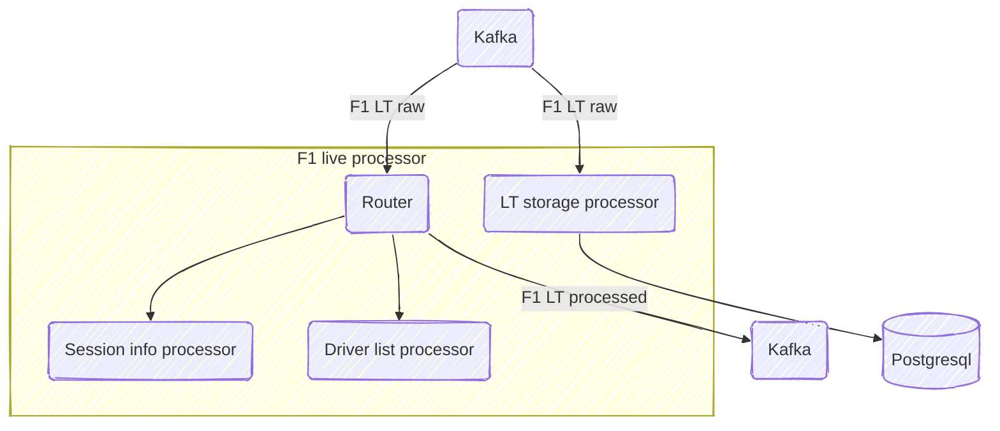
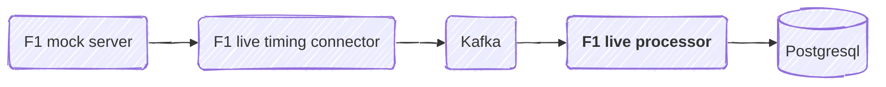

# f1-live-processor
Processes F1 livetiming messages and organizes the data to be easier to consume for (web) UIs. 

##
Livetiming message categories:
- `LapCount`.
- `DriverList`.
- `TeamRadio`.
- `SessionInfo`.
- `SessionData`.
- `TrackStatus`.
- `RaceControlMessages`.
- `TimingData`.
- `TimingAppData`.
- `TimingStats`.
- `TopThree`.
- `PitLaneTimeCollection`.
- `WeatherData`.
- `ExtrapolatedClock`.


```mermaid
---
config:
    look: handDrawn
---
flowchart TB
    A(Kafka)
    subgraph B [F1 live processor]
        direction LR
        B1(LT storage processor)
        B2(Router)
        B3(Session info processor)
        B4(Driver list processor)
        B2 --> B3
        B2 --> B4
    end
    A -->|F1 LT raw| B1
    A -->|F1 LT raw| B2
    B2 -->|F1 LT processed| C(Kafka)
    B1 --> E[(Postgresql)]
    
```
## Data samples
### TimingAppData
Start of session:
```Json
{
  "Lines": {
    "1": {
      "Stints": [
        {
          "New": "true",
          "Compound": "MEDIUM",
          "LapFlags": 0,
          "StartLaps": 0,
          "TotalLaps": 0,
          "TyresNotChanged": "0"
        }
      ]
    },
    "3": {
      "Stints": [
        {
          "New": "true",
          "Compound": "MEDIUM",
          "LapFlags": 0,
          "StartLaps": 0,
          "TotalLaps": 0,
          "TyresNotChanged": "0"
        }
      ]
    },
    "4": {
      "Some more data": "etc"
    }
  }
}
```
During session:
```Json
{
  "Lines": {
    "3": {
      "Stints": {
        "0": {
          "TotalLaps": 2
        }
      }
    },
    "10": {
      "Stints": {
        "0": {
          "TotalLaps": 2
        }
      }
    },
    "12": {
      "Some more data": "etc"
    }
  }
}
```
### TopThree
Non-streaming message just before the session starts. Note the data in `DiffToAhead` with `LAP 1` and `""`:
```Json
{
  "_kf": true,
  "Lines": [
    {
      "Tla": "ANT",
      "Team": "Mercedes",
      "LapTime": "",
      "FullName": "Kimi ANTONELLI",
      "LapState": 80,
      "LastName": "Antonelli",
      "Position": "1",
      "FirstName": "Kimi",
      "Reference": "ANDANT01",
      "TeamColour": "00D7B6",
      "DiffToAhead": "LAP 1",
      "DiffToLeader": "LAP 1",
      "RacingNumber": "12",
      "ShowPosition": true,
      "BroadcastName": "K ANTONELLI",
      "OverallFastest": false,
      "PersonalFastest": false
    },
    {
      "Tla": "RUS",
      "Team": "Mercedes",
      "LapTime": "",
      "FullName": "George RUSSELL",
      "LapState": 80,
      "LastName": "Russell",
      "Position": "2",
      "FirstName": "George",
      "Reference": "GEORUS01",
      "TeamColour": "00D7B6",
      "DiffToAhead": "",
      "DiffToLeader": "",
      "RacingNumber": "63",
      "ShowPosition": true,
      "BroadcastName": "G RUSSELL",
      "OverallFastest": false,
      "PersonalFastest": false
    },
    {
      "Tla": "PIA",
      "Team": "McLaren",
      "LapTime": "",
      "FullName": "Oscar PIASTRI",
      "LapState": 80,
      "LastName": "Piastri",
      "Position": "3",
      "FirstName": "Oscar",
      "Reference": "OSCPIA01",
      "TeamColour": "F47600",
      "DiffToAhead": "",
      "DiffToLeader": "",
      "RacingNumber": "81",
      "ShowPosition": true,
      "BroadcastName": "O PIASTRI",
      "OverallFastest": false,
      "PersonalFastest": false
    }
  ],
  "Withheld": false
}
```
Streaming data during in-session offers partial updates:
```Json
{
  "Lines": {
    "1": {
      "DiffToAhead": "+0.097",
      "DiffToLeader": "+0.097"
    }
  }
}
```

### TimingStats
Statistics over best lap, best speed, etc. First data object is non-streaming just before the session starts. Please note that `BestSectors` have array notation in the initial baseline object (non-streaming), but use object notation in the streaming updates. Note the default value (i.e. no data):
```Json
{
  "_kf": true,
  "Lines": {
    "1": {
      "Line": 1,
      "BestSpeeds": {
        "FL": {
          "Value": ""
        },
        "I1": {
          "Value": ""
        },
        "I2": {
          "Value": ""
        },
        "ST": {
          "Value": ""
        }
      },
      "BestSectors": [
        {
          "Value": ""
        },
        {
          "Value": ""
        },
        {
          "Value": ""
        }
      ],
      "RacingNumber": "1",
      "PersonalBestLapTime": {
        "Value": ""
      }
    }
  }
}
```
Streaming data during in-session offers partial updates:
```Json
{
  "Lines": {
    "1": {
      "BestSpeeds": {
        "I1": {
          "Value": "289",
          "Position": 1
        }
      }
    },
    "16": {
      "BestSpeeds": {
        "I1": {
          "Position": 3
        }
      }
    },
    "81": {
      "BestSpeeds": {
        "I1": {
          "Position": 2
        }
      }
    }
  }
}
```

### TimingData
The most verbose data stream. It is initialized with a non-streaming message just before the session starts (see `TimingData-init.json`). Updates about three times per second with partial updates during session. Please note that `sectors` and `segments` have array notation in the initial baseline object (non-streaming), but use object notation in the streaming updates. Example:
```Json
{
  "Lines": {
    "3": {
      "Sectors": {
        "1": {
          "PreviousValue": "41.581"
        }
      }
    },
    "10": {
      "Sectors": {
        "1": {
          "PreviousValue": "41.705"
        }
      }
    },
    "16": {
      "Speeds": {
        "FL": {
          "Value": "279"
        }
      },
      "Sectors": {
        "2": {
          "Value": "17.810"
        }
      },
      "BestLapTime": {
        "Lap": 53,
        "Value": "1:32.634"
      },
      "LastLapTime": {
        "Value": "1:32.634",
        "PersonalFastest": true
      },
      "NumberOfLaps": 53
    },
    "81": {
      "Sectors": {
        "2": {
          "PreviousValue": "17.968"
        }
      }
    }
  }
}
```

## Testing the application with local K8s
This application depends on interacting with other components, both upstream and downstream to do its job:


```mermaid
---
config:
    look: handDrawn
---
flowchart LR
    A(F1 mock server) --> B(F1 live timing connector)
    B --> C(Kafka)
    C --> D("`**F1 live processor**`")
    D --> E[(Postgresql)]
```
When developing and testing with a local K8s runtime, you can activate all the prerequisites by running the following commands:

Navigate to the folder `./kubernetes-manifests/prerequisites-1` and run the following command:
```console
$ kubectl apply --server-side -k .
```
> The installation may report errors on the first run. In that case just re-run the install command.

In order to uninstall the services, run:
```console
$ kubectl delete -k .
```
Do the same for the folder `./kubernetes-manifests/prerequisites-1`.

Temporary fix on Windows: 
Build the application image:
```console
$ .\build-local.ps1
```
Then deploy the app to your local K8s cluster:
```console
$  kubectl apply --server-side -k kubernetes-manifests\
```

Lastly, start the `f1-live-processor` application via skaffold. Navigate to the project root and run
```console
$ skaffold dev
```

## Running the application in dev mode

You can run your application in dev mode that enables live coding using:

```shell script
./mvnw quarkus:dev
```

> **_NOTE:_**  Quarkus now ships with a Dev UI, which is available in dev mode only at <http://localhost:8080/q/dev/>.

## Packaging and running the application

The application can be packaged using:

```shell script
./mvnw package
```

It produces the `quarkus-run.jar` file in the `target/quarkus-app/` directory.
Be aware that it’s not an _über-jar_ as the dependencies are copied into the `target/quarkus-app/lib/` directory.

The application is now runnable using `java -jar target/quarkus-app/quarkus-run.jar`.

If you want to build an _über-jar_, execute the following command:

```shell script
./mvnw package -Dquarkus.package.jar.type=uber-jar
```

The application, packaged as an _über-jar_, is now runnable using `java -jar target/*-runner.jar`.
