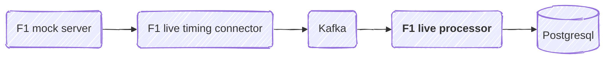

# f1-live-processor

##
Livetiming message categories:
- `LapCount`.
- `DriverList`.
- `TeamRadio`.
- `SessionInfo`.
- `SessionData`.
- `TrackStatus`.
- `RaceControlMessages`.
- `TimingData`.
- `TimingAppData`.
- `TimingStats`.
- `TopThree`.
- `PitLaneTimeCollection`.
- `WeatherData`.
- `ExtrapolatedClock`.

## Testing the application with local K8s
This application depends on interacting with other components, both upstream and downstream to do its job:


When developing and testing with a local K8s runtime, you can activate all the prerequisites by running the following commands:

Navigate to the folder `./kubernetes-manifests/prerequisites-1` and run the following command:
```console
$ kubectl apply --server-side -k .
```
> The installation may report errors on the first run. In that case just re-run the install command.

In order to uninstall the services, run:
```console
$ kubectl delete -k .
```
Do the same for the folder `./kubernetes-manifests/prerequisites-1`.

Temporary fix on Windows: 
Build the application image:
```console
$ .\build-local.ps1
```
Then deploy the app to your local K8s cluster:
```console
$  kubectl apply --server-side -k kubernetes-manifests\
```

Lastly, start the `f1-live-processor` application via skaffold. Navigate to the project root and run
```console
$ skaffold dev
```

## Running the application in dev mode

You can run your application in dev mode that enables live coding using:

```shell script
./mvnw quarkus:dev
```

> **_NOTE:_**  Quarkus now ships with a Dev UI, which is available in dev mode only at <http://localhost:8080/q/dev/>.

## Packaging and running the application

The application can be packaged using:

```shell script
./mvnw package
```

It produces the `quarkus-run.jar` file in the `target/quarkus-app/` directory.
Be aware that it’s not an _über-jar_ as the dependencies are copied into the `target/quarkus-app/lib/` directory.

The application is now runnable using `java -jar target/quarkus-app/quarkus-run.jar`.

If you want to build an _über-jar_, execute the following command:

```shell script
./mvnw package -Dquarkus.package.jar.type=uber-jar
```

The application, packaged as an _über-jar_, is now runnable using `java -jar target/*-runner.jar`.
